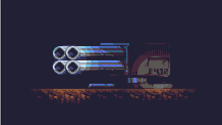

# Lighting engine

Small experimental lighting engine aimed towards pixel art games written with SFML and GLSL.  
Sprites used in the example were made by myself, using the DB32 palette.

This program applies lighting by using a LUT for every color from the palette, entirely through indexed colors.

## Usage

- `[LMB]`: Place lights
- `[ + ]`: Increase light intensity
- `[ - ]`: Decrease light intensity
- Mouse wheel: Change light radius